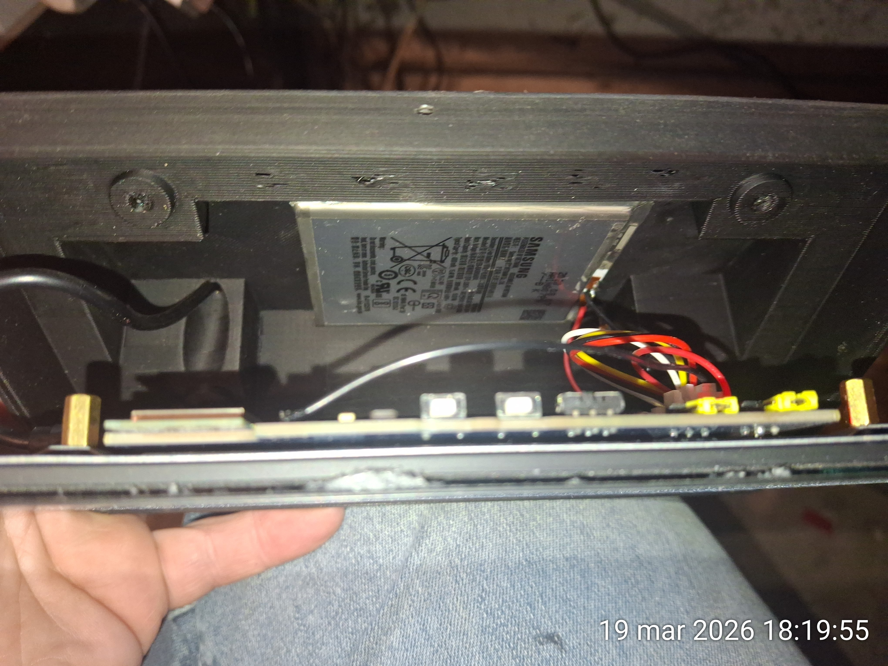
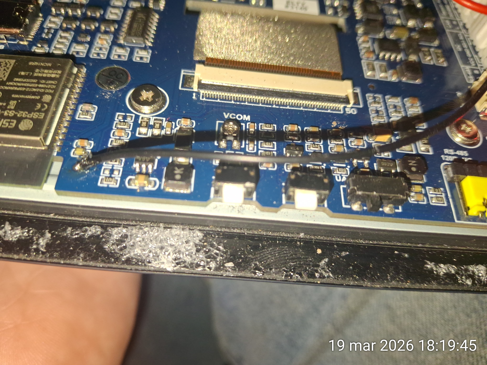

# ESPHome ESP32-S3 7-inch LVGL Smart Home Dashboard 🇬🇧
A comprehensive, feature-rich smart home control panel (Home Assistant) based on a 7-inch touchscreen with an ESP32-S3 microcontroller. The user interface is built entirely using the powerful **LVGL** library within the **ESPHome** environment.

> 🇵🇱 **Note for Polish speakers:** W przyszłości opublikowana zostanie również polska wersja dokumentacji! (Aktualny kod obsługuje już płynne przełączanie języka PL/EN w locie).

---
https://github.com/user-attachments/assets/28501945-e72b-47df-8c0f-5de732e042ea
## 📸 Project Gallery

Below is a presentation of the individual screens and hardware details:

### General View & Menu

### Core Dashboards (Power & Utilities)
| Detailed Energy Flow | Battery & Charging Status |
| :---: | :---: |
|  |  |

### Other Feature Screens
| Climate Control | Lighting & Home Control |
| :---: | :---: |
|  |  |

### System & Hardware
| Weather Radar | Rear View (PCB) |
| :---: | :---: |
|  |  |

 

<i>Hardware Backlight Modification</i>

---

## ✨ Main Features

* **Multilanguage UI:** Instant switching between English and Polish directly from the dashboard without rebooting.
* **Advanced Energy Flow:** Dynamic diagrams with real-time PV production, grid status, and daily profit calculations.
* **Utility Management:** Track water, gas, and electricity costs (monthly and annual summaries).
* **Climate & Lighting:** Full HVAC and lighting control integrated with Home Assistant.
* **Live Weather Radar:** Real-time precipitation radar maps downloaded directly to the screen.
* **Modular Code:** Clean ESPHome configuration split into logical packages (`packages/`) for easy maintenance.

---

## 🛠️ Hardware & Modifications

To achieve the full functionality of this dashboard, specific hardware additions and PCB modifications are required:

### 1. Screen Backlight Modification (PWM Control)
By default, the 7-inch screen's backlight is hardwired to be permanently on at 100% brightness. To allow ESPHome to control the brightness via a software slider and enable automatic screen timeout/dimming, you must modify the PCB.
* **Action:**  Solder a jumper wire to an available ESP32 PWM-capable pin.
* **Reference:** See `images/backlight_mod.jpg` for exact soldering points.

### 2. 1S Battery Installation (UPS functionality)
The dashboard is designed to run uninterrupted even during power outages.
* **Action:** Connect a standard 3.7V 1S Li-Po or Li-Ion cell to the board. This acts as a built-in UPS.

### 3. INA219 Battery Monitoring Module
To accurately display the battery percentage and charging status on the dashboard, an external I2C sensor is used.
* **Action:** Connect an **INA219** module to the ESP32's I2C pins.
* **Purpose:** The INA219 precisely measures the battery voltage (calibrated between 3.2V - 4.2V) and current, feeding this data to the `battery.yaml` package to render the UI battery icon and percentage.

---

## 🔌 Required Home Assistant Entities

Map your specific Home Assistant entities in the `sensors.yaml` file. 

### ☀️ Weather & Environment
* **Outdoor/Indoor Humidity** (`%`) & **Pressure** (`hPa`)
* **Wind Speed** (`km/h`) & **Wind Direction** (`°`)
* **Solar Radiation** (`W/m²`) & **UV Index**
* **Precipitation** (`mm/h`, `mm`)

### ⚡ Photovoltaics & Power
* **Current Power** (`W`) & **PV Yield Today/Total** (`kWh`)
* **Inverter AC Grid** (`V`, `A`, `Hz`) & **DC Panels** (`V`, `A`)
* **Inverter Temperature** (`°C`)

### 💰 Costs & Utilities (Monthly/Annual)
* **Electricity, Water, and Gas Costs** (`currency`)
* **PV Profit & Savings** (`currency`)
* **Energy in Storage** (`kWh`)

### 🌡️ Climate Control
* **Room Temperature** (`°C`) & **Target Setpoint** (`°C`)
* **Heating State** (`boolean`)

---

## 🗺️ Live Radar Maps (HA Script Setup)

The dashboard displays live weather radar maps by pulling images from your Home Assistant's local directory. 

For this to work, you must set up a script or automation in Home Assistant that periodically downloads radar images and saves them to your `www` folder as:
* `/config/www/gotowy_radar.png` (Local Radar)
* `/config/www/gotowy_radar_europa.png` (Europe Radar)

**⚠️ Important Region Note:** If you are using the sample HA python/bash script provided in this repository, please note that **the default map coordinates are set for Southern Poland and Europe**. 
* You **must** modify the script's bounding box (longitude/latitude) and crop settings to match your specific geographic location and region.

---

## 🚀 Installation

1. **Clone the repository:** Download all `.yaml` files and folders.
2. **Fonts:** Ensure the `materialdesignicons-webfont.ttf` file is correctly placed in the `fonts/materialdesignicons-webfont.ttf` path relative to your ESPHome configuration directory.
3. **Entities:** Update `sensors.yaml` with your Home Assistant entity IDs.
4. **Compile:** Use ESPHome to compile and flash the firmware to your ESP32-S3.

---

## 🙏 Acknowledgments
* **Special thanks to Irek** for providing the 3D printer and support in creating the physical housing for this project.

---
**Author:** [thomstas]  
**Technologies:** ESPHome, LVGL, C++, Home Assistant
